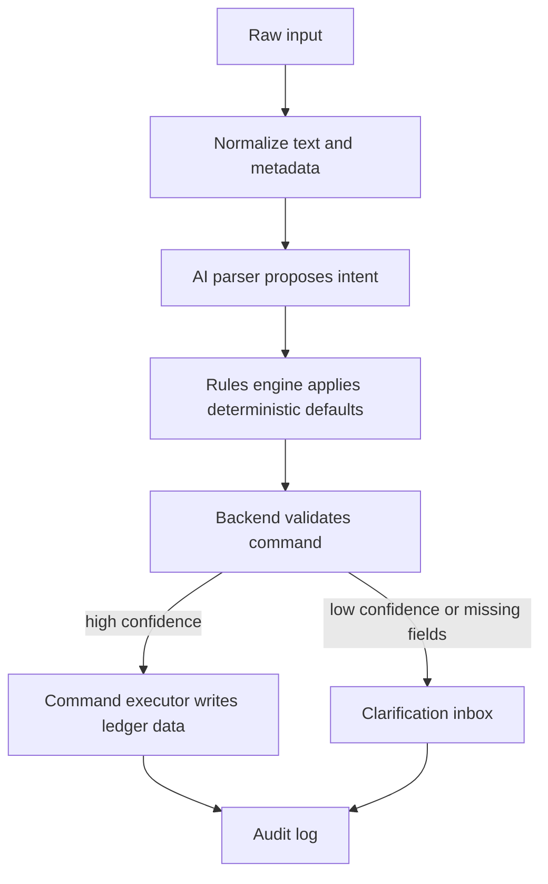

# AI Intake

AI intake turns messy user input into a structured financial command. It must be
designed as a proposal pipeline, not as direct database mutation.

## Supported Inputs

- Manual form data
- Text commands
- Voice transcripts
- Receipt OCR or vision output

## Pipeline



## Parsed Intent Shape

The first parser contract should cover common entry creation and group append
flows:

```ts
type ParsedFinanceIntent = {
  action: "create_entry" | "append_to_group" | "create_rule" | "answer_query";
  entry?: {
    type: "income" | "expense" | "adjustment";
    amount: number;
    currency: string;
    merchant?: string;
    accountName?: string;
    categoryName?: string;
    occurredAt?: string;
    note?: string;
  };
  group?: {
    id?: string;
    name?: string;
  };
  rule?: {
    conditionType: "merchant" | "phrase" | "source" | "amount_range";
    conditionValue: string;
    actionType: "set_category" | "set_account" | "set_group";
    actionValue: string;
  };
  query?: {
    metric: "monthly_net" | "category_spend" | "group_total";
    period?: string;
    categoryName?: string;
    groupName?: string;
  };
  confidence: number;
  missingFields: string[];
  explanation: string;
};
```

Do not expose this as a final API contract until the product flow is implemented.
For now, it is a design target for `packages/contracts`.

## Example: Create Expense

Input:

```txt
Gaste 3.19 en Starbucks con BAC, comida, hoy.
```

Output:

```json
{
  "action": "create_entry",
  "entry": {
    "type": "expense",
    "amount": 3.19,
    "currency": "USD",
    "merchant": "Starbucks",
    "accountName": "BAC",
    "categoryName": "Food",
    "occurredAt": "2026-07-14T12:00:00-06:00",
    "note": "Captured from text command"
  },
  "confidence": 0.94,
  "missingFields": [],
  "explanation": "The command describes a food expense paid with BAC."
}
```

## Example: Append To Group

Input:

```txt
Agrega 3.15 de Subway a Hackathon expenses.
```

Output:

```json
{
  "action": "append_to_group",
  "entry": {
    "type": "expense",
    "amount": 3.15,
    "currency": "USD",
    "merchant": "Subway",
    "categoryName": "Food"
  },
  "group": {
    "name": "Hackathon expenses"
  },
  "confidence": 0.9,
  "missingFields": ["accountName"],
  "explanation": "The command adds a new expense entry to an existing group."
}
```

## Confidence Policy

Suggested starting thresholds:

- `>= 0.90`: create posted entry if required fields resolve.
- `0.70 - 0.89`: create `NEEDS_REVIEW` draft or send to clarification inbox.
- `< 0.70`: do not create a ledger entry.

Rules can increase completeness, but they should not hide uncertainty. If a rule
fills a category, record the rule id in audit metadata.

## Provider Boundary

Future package target:

```ts
export interface AiParser {
  parseText(input: string): Promise<ParsedFinanceIntent>;
  parseReceipt(input: ReceiptParseInput): Promise<ParsedFinanceIntent>;
  transcribeAudio(input: AudioTranscriptionInput): Promise<string>;
}
```

Provider-specific code should live behind this interface so the app can switch
between OpenAI, local models, cloud OCR, or self-hosted services later.

## Implementation Order

1. Add text parser contract in `packages/contracts`.
2. Add a backend `ai-intake` module that returns parsed intent without writing.
3. Add command executor that turns validated intent into ledger writes.
4. Add audit logs for parser result, rule application, and command execution.
5. Add low-confidence review flow.
6. Add voice transcription.
7. Add receipt OCR.
