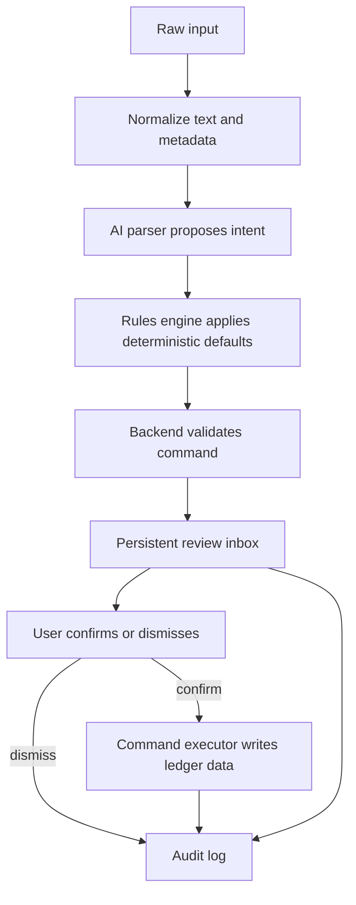

# AI Intake

AI intake turns messy user input into a structured financial command. It must be
designed as a proposal pipeline, not as direct database mutation.

## Supported Inputs

- Manual form data
- Text commands
- Voice transcripts
- Receipt OCR or vision output

## Pipeline


```mermaid
flowchart TD
    Input["Raw input"]
    Normalize["Normalize text and metadata"]
    Parse["AI parser proposes intent"]
    Rules["Rules engine applies deterministic defaults"]
    Validate["Backend validates command"]
    Review["Persistent review inbox"]
    Confirm["User confirms or dismisses"]
    Execute["Command executor writes ledger data"]
    Audit["Audit log"]

    Input --> Normalize
    Normalize --> Parse
    Parse --> Rules
    Rules --> Validate
    Validate --> Review
    Review --> Confirm
    Confirm -->|confirm| Execute
    Confirm -->|dismiss| Audit
    Execute --> Audit
    Review --> Audit
```

## Parsed Intent Shape

The first parser contract should cover common entry creation and group append
flows:

```ts
type ParsedFinanceIntent = {
  action: "create_entry" | "append_to_group" | "create_rule" | "answer_query";
  entry?: {
    type: "income" | "expense" | "adjustment";
    amount: number;
    currency: string;
    merchant?: string;
    accountName?: string;
    categoryName?: string;
    occurredAt?: string;
    note?: string;
  };
  group?: {
    id?: string;
    name?: string;
  };
  rule?: {
    conditionType: "merchant" | "phrase" | "source" | "amount_range";
    conditionValue: string;
    actionType: "set_category" | "set_account" | "set_group";
    actionValue: string;
  };
  query?: {
    metric: "monthly_net" | "category_spend" | "group_total";
    period?: string;
    categoryName?: string;
    groupName?: string;
  };
  confidence: number;
  missingFields: string[];
  explanation: string;
};
```

The implemented text endpoint exposes a narrower validated proposal contract in
`packages/contracts`. Broader actions in this example remain design targets.

## Example: Create Expense

Input:

```txt
Gaste 3.19 en Starbucks con BAC, comida, hoy.
```

Output:

```json
{
  "action": "create_entry",
  "entry": {
    "type": "expense",
    "amount": 3.19,
    "currency": "USD",
    "merchant": "Starbucks",
    "accountName": "BAC",
    "categoryName": "Food",
    "occurredAt": "2026-07-14T12:00:00-06:00",
    "note": "Captured from text command"
  },
  "confidence": 0.94,
  "missingFields": [],
  "explanation": "The command describes a food expense paid with BAC."
}
```

## Example: Append To Group

Input:

```txt
Agrega 3.15 de Subway a Hackathon expenses.
```

Output:

```json
{
  "action": "append_to_group",
  "entry": {
    "type": "expense",
    "amount": 3.15,
    "currency": "USD",
    "merchant": "Subway",
    "categoryName": "Food"
  },
  "group": {
    "name": "Hackathon expenses"
  },
  "confidence": 0.9,
  "missingFields": ["accountName"],
  "explanation": "The command adds a new expense entry to an existing group."
}
```

## Confirmation Policy

Text parsing never writes a ledger entry automatically. Every successful parse
creates a `PROPOSED` input session. The review UI shows the normalized fields,
confidence, and any deterministic rule matches. The user must select valid owned
references and confirm before the backend creates a `POSTED` entry.

Confidence remains useful context but is not an auto-post threshold. Rules can
increase completeness, but they do not bypass confirmation. Applied rule IDs are
stored with the session and included in structured audit metadata.

## Provider Boundary

Future package target:

```ts
export interface AiParser {
  parseText(input: string): Promise<ParsedFinanceIntent>;
  parseReceipt(input: ReceiptParseInput): Promise<ParsedFinanceIntent>;
  transcribeAudio(input: AudioTranscriptionInput): Promise<string>;
}
```

Provider-specific code should live behind this interface so the app can switch
between OpenAI, local models, cloud OCR, or self-hosted services later.

## Implementation Order

Implemented: text parser contract, persisted proposal sessions, typed rule
application, confirmation/dismissal execution, and audit coverage.

Next: voice transcription and receipt OCR using the same proposal boundary.
