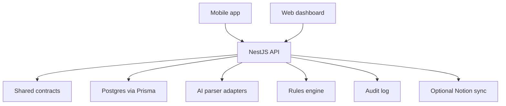

# Architecture

Finance Ledger is a privacy-first personal finance ledger. The product goal is
not only to record transactions, but to make capture fast, classification
reliable, grouped spending traceable, and raw media disposable.

## Current Shape

```txt
finance-ledger/
  apps/
    api/        NestJS API and backend orchestration
    mobile/     Expo app for quick capture
    web/        Next.js dashboard and admin views

  packages/
    contracts/  Shared Zod schemas and DTO types
    database/   Prisma schema, migrations, and client

  infra/
    docker-compose.yml

  docs/
    architecture.md
    ai-intake.md
    domain-model.md
    privacy-and-audit.md
    product-context.md
    roadmap.md
```

The original long-term package map also reserves room for:

```txt
packages/
  ai/       AI provider interfaces and adapters
  rules/    Deterministic categorization and automation engine
  config/   Shared runtime configuration
  ui/       Shared components, only if web/mobile overlap becomes real
```

Create these packages when there is code to put in them. Until then, keep the
contracts in `packages/contracts` and behavior in the owning app module.

## System Boundary



## Core Principle

AI never writes directly to the database.

AI may propose a structured financial intent. The backend validates ownership,
amounts, dates, categories, accounts, group actions, confidence, and privacy
policy before it creates or updates ledger data.

## Main Flows

### Manual Ledger Entry

1. Web or mobile submits a validated `CreateLedgerEntry` payload.
2. API verifies the referenced account and category belong to the user.
3. API derives `monthKey` from `occurredAt`.
4. API creates `LedgerEntry`.
5. API writes an `AuditLog` row.

### Quick Text Command

1. User enters text such as `gaste 3.19 en Starbucks con BAC`.
2. API records an input session with text modality.
3. Parser produces a proposed command.
4. Rules engine fills deterministic defaults, such as category by merchant.
5. API validates and executes the command if confidence is high enough.
6. Low-confidence commands go to a future clarification inbox.

### Voice or Receipt Capture

1. Mobile stores audio or image in local app cache.
2. Media is sent to a transcription or OCR provider.
3. Provider returns text or structured receipt data.
4. API stores only the transcript or redacted parse payload needed for traceability.
5. App deletes the raw local media after processing.
6. API stores `mediaDeletedAt` or equivalent evidence in the input session.

## Module Responsibilities

### Capture

Owns text, voice, receipt, quick buttons, and mobile widget entry points. Capture
does not decide final financial state.

### Parser

Converts natural language, transcript text, or OCR output into a structured
intent. Parser output must include confidence and unresolved fields.

### Rules

Applies deterministic user-owned rules, such as merchant-to-category, phrase-to-
account, or amount-range behavior. Rules should be explainable and auditable.

### Ledger

Owns the durable financial events. Ledger entries are append-friendly and should
avoid destructive edits where a grouped sub-event or adjustment is clearer.

### Groups

Represents parent financial events such as `Gasto semanal - Julio`, `Hackathon
expenses`, or `Universidad`. Group totals are calculated from ledger entries.

### Analytics

Builds monthly net, income breakdown, expense breakdown, trend, and group total
views from ledger data. Totals should generally be calculated, not manually
stored.

### Privacy and Audit

Ensures raw media is not retained, user-visible explanations are available, and
important state changes produce logs.

### Notion Sync

Optional mirror only. Postgres remains the source of truth.

## Data Ownership

Every user-owned table should carry `userId` and every API query must filter by
that user. The current development API uses `DEV_USER_ID`; production auth should
replace that with an authenticated user context before multi-user release.

## Future Background Work

Use background jobs for slow or retryable tasks:

- Audio transcription
- Receipt OCR
- AI parsing
- Notion sync
- Recurring expense detection
- Monthly summary materialization, if needed

Keep synchronous API paths for direct manual entry and read views.
